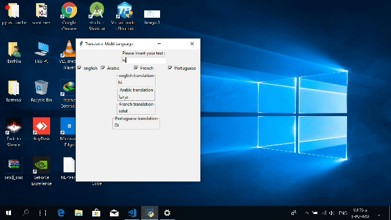

# Realtime Multi translator

<p align="center">

</p>


Realtime Multi translator is a python program that translate from many language to many without waste of time (pre-alpha version)

  - Fast
  - Simple GUI
  - Very good for practicing

> The main goal of this app is
> make translation more easier for student

## Installation

Realtime Multi translator requires [Python3](https://www.python.org/downloads/) v3 to run.

Install the dependencies  and start.

```sh
$ sudo apt install python3-tk
$ pip install textblob
$ python3 main.py
```
License
----

GNU

